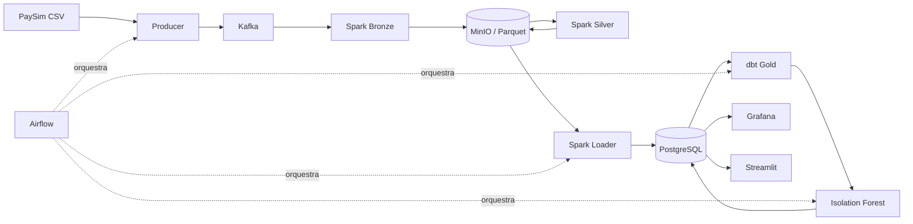

# Fraud Streaming Pipeline

[](https://github.com/Lal3x/fraud-streaming-pipeline/actions/workflows/ci-cd.yml)
[](https://lal3x.github.io/fraud-streaming-pipeline/)

Pipeline de dados ponta a ponta para ingestão, processamento, modelagem e
investigação de transações financeiras potencialmente fraudulentas.

O projeto transforma o dataset PaySim em eventos Kafka, processa esses eventos
com Spark Structured Streaming, organiza um data lake em camadas, cria um
warehouse analítico com PostgreSQL e dbt, executa um Isolation Forest e entrega
análises no Grafana e no Streamlit. Todo o fluxo é orquestrado pelo Airflow.

> Projeto de portfólio focado em Engenharia de Dados, com ML aplicado como
> componente do produto analítico — não como notebook isolado.

> **Escopo da demonstração:** a base PaySim local possui 6.362.620 transações,
> mas a execução documentada publicou aproximadamente 27 mil eventos — cerca de
> 0,42% da base. O recorte é intencional: o objetivo principal é demonstrar
> ingestão incremental e processamento streaming ponta a ponta em uma máquina
> local, não apresentar um modelo antifraude treinado sobre todo o dataset.

## Arquitetura



## Destaques técnicos

- Kafka producer idempotente, checkpoint local e IDs determinísticos.
- Spark Structured Streaming com schema explícito, watermark e deduplicação.
- Data lake Bronze/Silver em Parquet com MinIO e checkpoints independentes.
- Regras de risco explicáveis, sem usar os rótulos do dataset como features.
- Carga PostgreSQL idempotente com staging, manifesto de arquivos e auditoria.
- Projeto dbt com staging, intermediate, fatos, dimensões, marts e 41 testes.
- Isolation Forest com corte temporal, versionamento de execução e scores persistidos.
- Comparação honesta entre regras, ML e fraude real.
- Airflow com proteção contra avanço de cargas parciais.
- Grafana operacional e Streamlit para investigação de transações.
- Limites de memória adequados a uma máquina local/WSL2.

## Resultado de uma execução local

| Indicador | Resultado |
| --- | ---: |
| Transações na Gold | 27.034 |
| Fraudes rotuladas | 82 |
| Alertas por regras | 7.797 |
| Scores do modelo mais recente | 27.034 |
| Anomalias do modelo mais recente | 276 |

Esses números são um retrato de uma execução local e mudam conforme novos
lotes são publicados. A análise completa, incluindo limitações do modelo, está
na página [Resultados e aprendizados](docs/results.md).

As métricas do Isolation Forest são, portanto, preliminares. Elas comprovam que
features, treino, versionamento, scoring e avaliação estão integrados ao
pipeline, mas não representam o desempenho que seria obtido usando toda a base.

## Como executar

```bash
cp .env.example .env

docker compose --env-file .env \
  -f infrastructure/streaming/docker-compose.yml up -d

docker compose --env-file .env \
  -f infrastructure/analytics/docker-compose.yml up -d postgres

docker compose --env-file .env \
  -f infrastructure/airflow/docker-compose.yml up airflow-init

docker compose --env-file .env \
  -f infrastructure/airflow/docker-compose.yml up -d
```

Abra [http://localhost:8083](http://localhost:8083), execute a DAG
`fraud_bronze_to_gold` e acompanhe o fluxo completo.

## Interfaces

| Serviço | Endereço | Objetivo |
| --- | --- | --- |
| Airflow | [localhost:8083](http://localhost:8083) | Orquestração e logs |
| Spark Master | [localhost:8080](http://localhost:8080) | Aplicações e recursos |
| MinIO | [localhost:9001](http://localhost:9001) | Objetos Bronze/Silver |
| Kafka UI | [localhost:8082](http://localhost:8082) | Tópicos e offsets |
| Grafana | [localhost:3000](http://localhost:3000) | Dashboard operacional |
| Streamlit | [localhost:8501](http://localhost:8501) | Análise e investigação |

## Documentação completa

```bash
poetry install --with dev
poetry run mkdocs serve
```

Acesse [http://127.0.0.1:8000](http://127.0.0.1:8000). Para validar o site:

```bash
poetry run mkdocs build --strict
```

## Qualidade

```bash
poetry run task lint
poetry run task tests
```

A suíte exige cobertura mínima de 70%. Atualmente, os 52 testes unitários
atingem 71,84%; no CI, os testes Spark também são executados com Java 17.

## Escopo

Este é um ambiente educacional e de portfólio. Ele demonstra decisões e
práticas de uma plataforma de dados, mas não deve ser interpretado como um
sistema antifraude pronto para produção ou como recomendação financeira.
