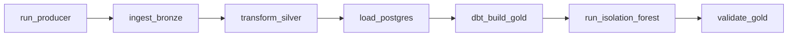

# Orquestração com Airflow

A DAG `fraud_bronze_to_gold` executa o pipeline nesta ordem:

## Parâmetros principais

| Parâmetro | Padrão | Função |
| --- | ---: | --- |
| `producer_limit` | 10000 | Eventos publicados pelo produtor |
| `events_per_second` | 100 | Limite de publicação |
| `bronze_settle_seconds` | 20 | Espera da Bronze |
| `silver_settle_seconds` | 120 | Espera da Silver |
| `full_refresh` | false | Reconstrução integral dos incrementais dbt |

## Proteção contra carga parcial

O loader recebe `producer_limit` como `EXPECTED_MIN_RECORDS`. Se o Silver ainda
não tiver produzido pelo menos essa quantidade de novos registros, a tarefa
falha antes de marcar arquivos como processados. Os retries do Airflow podem
então repetir a carga com segurança.

Essa validação impede que dbt e ML avancem quando o streaming ainda está
processando o lote.
