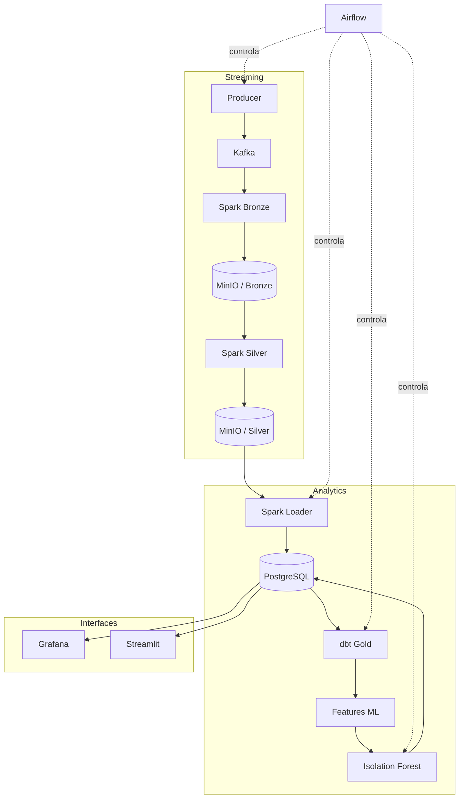

# Arquitetura

## Componentes

## Responsabilidade por camada

### Bronze

Preserva o valor recebido do Kafka junto com tópico, partição, offset,
timestamp, headers e horário de ingestão. O formato de armazenamento é Parquet
com compressão Snappy.

### Silver

Interpreta o JSON com schema explícito, separa eventos inválidos, deduplica por
`event_id`, cria atributos de saldo e aplica regras explicáveis de risco.

### Gold

O dbt materializa fatos, dimensões e marts para dashboard, saúde do pipeline,
Lei de Benford, features do modelo e avaliação do Isolation Forest.

## Garantias e trade-offs

- O `event_id` deriva da posição do registro no PaySim e é reproduzível.
- Checkpoints permitem retomar o consumo sem reiniciar do zero.
- O PostgreSQL aplica unicidade por evento como última barreira contra duplicatas.
- A deduplicação do Spark é limitada pelo watermark configurado.
- Parquet não oferece as mesmas transações ACID de Iceberg ou Delta Lake.
- O ambiente local privilegia baixo consumo de memória em vez de throughput máximo.
