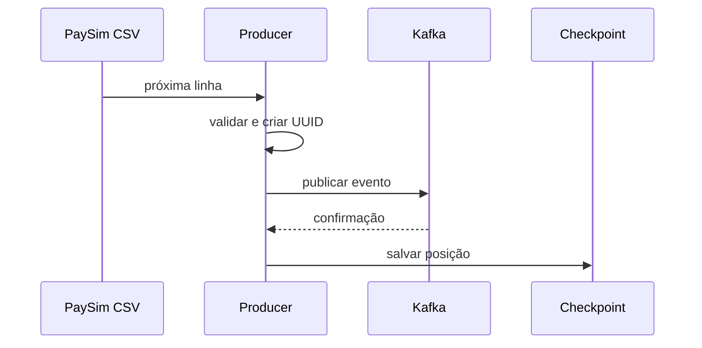

# Fluxo de dados

## 1. Fonte e producer

`PaySimReader` usa `csv.DictReader` como iterator. Mesmo com um CSV grande, o
processo mantém apenas a linha atual na memória. O producer:

- cria `source_record_id` a partir da posição da linha;
- deriva `event_id` com UUID v5;
- converte o `step` do PaySim em `event_time`;
- valida o contrato com Pydantic;
- envia JSON ao Kafka usando a conta de origem como chave;
- espera confirmação com `acks=all` e idempotência habilitada;
- atualiza o checkpoint somente após a confirmação.



## 2. Bronze

O Spark lê o tópico continuamente e grava o payload sem aplicar regra de
negócio. Além de `raw_value`, preserva tópico, partição, offset, timestamp,
headers e horário de ingestão. A saída é particionada por ano, mês, dia e hora.

Essa camada permite reprocessar a lógica downstream sem republicar o CSV.

## 3. Silver

O JSON é interpretado com `StructType` e funções nativas Spark:

```text
parse → validar → separar inválidos → watermark → deduplicar
      → enriquecer → aplicar regras → transactions + fraud-alerts
```

Eventos inválidos mantêm payload e motivos de rejeição. Eventos válidos recebem
atributos de saldo, faixas de valor, score, nível de risco e regras acionadas.

## 4. Loader PostgreSQL

O loader lista somente Parquets ainda ausentes em `monitoring.loaded_files`:

1. Descobre arquivos novos.
2. Confirma que o lote mínimo esperado está disponível.
3. Persiste temporariamente em disco, não em RAM.
4. Escreve tabelas de staging via JDBC.
5. Promove dados em transação PostgreSQL.
6. Usa `ON CONFLICT DO NOTHING` para idempotência.
7. Registra arquivos, contagens e status.
8. Limpa o staging da execução.

## 5. dbt Gold

O dbt normaliza fontes, cria métricas reutilizáveis e materializa fatos,
dimensões, marts e features. Testes são executados durante o `dbt build` e
novamente pela tarefa final da DAG.

## 6. Isolation Forest

O modelo lê a tabela de features, aplica uma janela máxima, faz corte temporal,
treina no primeiro segmento e pontua todo o conjunto. Scores são versionados e
persistidos separadamente da tabela de features.

## 7. Consumo

Grafana lê marts e fatos para monitoramento. Streamlit combina fatos, regras,
scores e rótulos para exploração e investigação.
