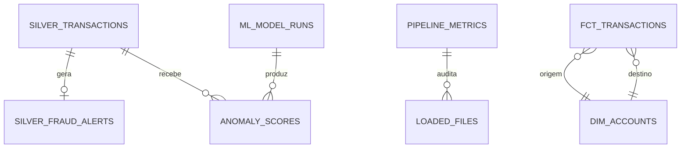

# Modelo de dados

## Visão lógica



## Schemas PostgreSQL

| Schema | Responsabilidade |
| --- | --- |
| `loading` | Staging efêmero usado pelo loader |
| `silver` | Dados validados e alertas explicáveis |
| `staging` | Views dbt normalizadas |
| `intermediate` | Transformações reutilizáveis |
| `analytics` | Fatos, dimensões, marts, features e scores |
| `monitoring` | Cargas, arquivos processados e execuções ML |

## Tabelas centrais

### `silver.transactions`

Grão de uma transação válida. `event_id` é a chave primária. A tabela contém
dados financeiros, contas, timestamps, atributos de saldo, regras, score,
rótulos PaySim e identificadores de rastreabilidade.

### `analytics.fct_transactions`

Fato incremental no mesmo grão da Silver, enriquecido com classificação entre
alerta e rótulo. É a principal tabela para exploração transacional.

### `analytics.dim_accounts`

Consolida contas que aparecem como origem ou destino e suas métricas de
atividade. Relacionamentos dbt garantem que as chaves do fato existam na dimensão.

### `analytics.ml_transaction_features`

Uma linha por evento, contendo features de valor, horário, variações de saldo,
atividade recente e estatísticas históricas. Os rótulos são proibidos por testes
dbt para evitar leakage.

### `analytics.transaction_anomaly_scores`

Uma linha por evento e versão do modelo. Guarda split, score, decisão de
anomalia e timestamp da pontuação sem sobrescrever execuções anteriores.

## Marts

| Modelo | Uso |
| --- | --- |
| `mart_fraud_daily` | KPIs por data e tipo de transação |
| `mart_pipeline_health` | Saúde, duração e reconciliação das cargas |
| `mart_benford_first_digit` | Diagnóstico populacional de primeiros dígitos |
| `mart_anomaly_evaluation` | Matriz de confusão e métricas do modelo |

## Rastreabilidade

```text
source_record_id → event_id → Kafka partition/offset
→ Parquet source_file → load_id → fato Gold → model_version
```
