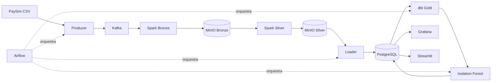

# Fraud Streaming Pipeline

Pipeline completo para ingestão, processamento e investigação de transações
financeiras potencialmente fraudulentas usando o dataset PaySim.

O projeto combina processamento contínuo, transformação analítica, regras
explicáveis e detecção de anomalias em uma arquitetura executável localmente.

## Principais tecnologias

| Área | Tecnologia |
| --- | --- |
| Mensageria | Apache Kafka |
| Processamento | Apache Spark Structured Streaming |
| Data lake | MinIO e Parquet |
| Banco analítico | PostgreSQL |
| Transformação | dbt |
| Machine Learning | scikit-learn Isolation Forest |
| Orquestração | Apache Airflow |
| Observabilidade | Grafana e Streamlit |

## Fluxo resumido

## O que o projeto demonstra

- Leitura incremental do CSV sem carregá-lo inteiro na memória.
- IDs determinísticos, checkpoints e deduplicação de eventos.
- Separação das camadas Bronze, Silver e Gold.
- Regras de fraude auditáveis e sem vazamento do rótulo real.
- Treino e avaliação temporal de um Isolation Forest.
- Comparação entre regras, ML e fraude rotulada.
- Investigação individual de transações e contas suspeitas.
- Execução local com limites de memória por serviço.

## Explore por objetivo

| Se você quer... | Comece por |
| --- | --- |
| Entender o problema e o escopo | [Sobre o projeto](project.md) |
| Ver como cada evento percorre a plataforma | [Fluxo de dados](data-flow.md) |
| Conhecer tabelas, marts e rastreabilidade | [Modelo de dados](data-model.md) |
| Rodar uma demonstração completa | [Executar localmente](getting-started.md) |
| Apresentar o projeto em entrevista | [Roteiro de demonstração](demo.md) |
| Avaliar o ML sem maquiagem de métricas | [Resultados e aprendizados](results.md) |
| Entender escolhas e trade-offs | [Decisões técnicas](decisions.md) |

## Resultado observado

Em uma execução documentada, o pipeline processou 27.034 transações e gerou
scores para todas elas. O resultado do Isolation Forest não coincidiu com as
fraudes rotuladas no corte de avaliação; essa limitação é apresentada de forma
explícita e orienta o roadmap de features e avaliação.

Essa execução representa aproximadamente 0,42% das 6,3 milhões de transações do
PaySim local. O recorte serve para demonstrar publicação incremental, streaming,
checkpoints, idempotência e orquestração sem exigir que toda a base seja
processada em uma máquina de desenvolvimento.

!!! info "Por que isso importa no portfólio?"
    O projeto demonstra não apenas integração de ferramentas, mas também
    capacidade de medir resultados, diagnosticar falhas operacionais e evoluir
    o desenho com base em evidências.

[Executar o projeto](getting-started.md){ .md-button .md-button--primary }
[Entender a arquitetura](architecture.md){ .md-button }
